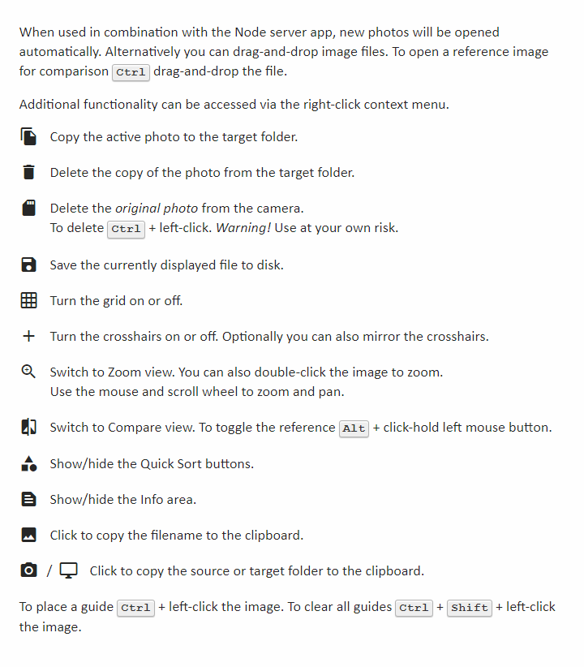

# Simple Photo Sync

Also known as poor man's tether, a basic camera to PC photo sync application implemented as a small Node-based webserver. Note that this is not a "live view" app!

## Problem

Many (older) cameras do not allow the camera to be tethered to your PC while taking pictures. Although you can often connect the camera via a USB cable, you need specialized software or a workaround to review/process the pictures.

I previously used a dedicated tether app for my camera (Lumon DMC-GX8) but after a few years, this app understandably looks to be no longer maintained or supported. I needed an alternative way to review pictures on my computer screen to verify the colors and layout.

Workflow: Connect camera to PC > Take picture > Automatically transfer photo and review on a PC screen > If needed make adjustments > Move to the next picture.

An additional requirement for me was the ability to check the layout of the pictures, especially straight lines and centering (product photography). Having an option to overlay a grid and quickly zoom in would be helpful. I also was looking for a "one-click" non-destructive way to sort/triage files for further processing (keep, star, discard). 

Optionally being able to review on a tablet would also be welcome.

## Requirements
Node.js

In order to access pictures on a camera's memory card, the camera needs to be connected to your PC and needs to be accessible via Explorer as a drive letter. 

## Installation

    npm install

For the application to work the camera's memory needs to be "mounted" as a drive (USB Mass Storage mode), or you will need to map a drive letter to the camera "MTP device".

I suggest using the **MTPdrive** application (https://www.mtpdrive.com/). MTPdrive can automate the process of mapping/assigning a dedicated drive letter to a connected MTP device and optionally start a specific application on connection. You can use the free trial to test if it works for you.

## Configuration

On first use a **config.local.json** file is created to store folder locations and default settings.

## Start

Open a terminal window or command line:

    node app

The application will be accessible in your web browser.
 
    http://localhost:3000
 
To streamline the startup process, use your browser to create an app from the webpage, and create a batch file to start the server and the app. Optionally start the batch file when the camera connects to the PC.

## How to use

You can update the configuration depending on your workflow. Default startup options can be set in the **config.local.json** file, additional settings can be changed via the right-click context menu.

- The most basic option is to let the tool automatically copy each new photo to your PC. Review the photo in the app. If needed make adjustments to the camera settings and/or subject and re-shoot or continue to the next photo.
- Another option is to activate the "Quick Sort" buttons (optionally in combination with the auto copy function). This allows you to quickly triage/sort photos after each shot. Each photo can be reviewed on your PC screen and by using the Quick Sort buttons you can move the image into one of four folders: **keep**, **star**, **review**, or **discard**. 

    

    The options are non-destructive, since discarded photos are stored in a folder called trash that can later be deleted. 

There are a few functions available in the right-click context menu to work with the files and make reviewing easier. The available options depend on the configuration. Press F1 to show the Help screen.

It is also possible to view the photos on another system (remotely) using the IP address of the Node server.

Optionally you can place a **reference.jpg** file in the application folder to be used as a default reference when comparing.

When automatically checking camera settings enter the required settings in the **config.local.json** under **defaults**  in the same way they are displayed in the app.

    "defaults": "M, SS 1/250, f/7.1, ISO 200, 0 EV, Flash fired, ratio 1:1"

You can copy the values to the clipboard from the right-click context menu.

## Optional: Create an executable using Electron
Install **Electron** and **Electron Packager** 

    npm install --save-dev electron   
    npm install --save-dev electron-packager   

Run the following command to create an application for your current environment

    npx electron-packager . --overwrite --asar

You will find the executable in a newly created folder (e.g. photosync-win32-x64). Settings are stored in a config.local.json file located in the same folder.  
Since the executable still runs a Node web server you can also access the app via a regular web browser. 

## Disclaimer

I am far from a professional programmer. I made this for personal use and posted it here in case someone else has a similar problem. Feel free to re-use the code and extend the functionality, but use the app at your own risk. 

Copy functionality is implemented using standard JavaScript filesystem functions, and although there is an option to delete files from the camera I strongly advise against this as it is always better to be safe than sorry when working with data. 

The actual connection to your camera depends on the operating system or a third-party app so I suggest to check for any known issues before using.

I have included links to code I have used in the comments.

## To-do

See the issue tracker
